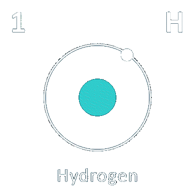

[JOAO PEDRO](mailto:d2022005016@unifei.edu.br) &bull;
[MARCELO CANDELARIA](mailto:d2023010164@unifei.edu.br) &bull;
[LUCA AUGUSTO](mailto:d2024004671@unifei.edu.br) &bull;
[LEO VARGAS](mailto:d2024006120@unifei.edu.br)

#   Estação de Reabastecimento de Hidrogênio 

[SITE](https://leovarconrenno.github.io/Estacao-de-Reabastecimento-de-Hidrogenio---SCADA-Core/) &bull;
[SLIDE](assets/slide/Estacao_H2_SCADA_Core.pdf)

## INTRODUÇÂO

Este projeto consiste no desenvolvimento de um sistema **SCADA** ([Supervisory Control and Data Acquisition](https://en.wikipedia.org/wiki/SCADA)) para supervisão e controle de uma planta industrial. O sistema será responsável por centralizar as informações provenientes dos dispositivos de campo, monitorar as principais variáveis do processo, controlar equipamentos e válvulas e fornecer ao operador uma visão integrada do estado da planta.

Como aplicação para o sistema, foi definida uma estação de reabastecimento de hidrogênio ([H₂](https://pt.wikipedia.org/wiki/Hidrog%C3%A9nio)) destinada ao abastecimento de veículos movidos a célula de combustível. A planta envolve etapas de armazenamento, condicionamento, pressurização e transferência de hidrogênio, além de diferentes equipamentos, sensores e dispositivos voltados à segurança da operação.

O **SCADA** será desenvolvido para simular e supervisionar o ciclo operacional da estação, desde a preparação para o abastecimento até sua finalização. Durante a simulação, o sistema deverá representar o estado dos equipamentos e das principais variáveis do processo, permitindo acompanhar a sequência de operação e a atuação dos dispositivos de controle. O sistema também deverá tratar situações anormais por meio de alarmes, intertravamentos e procedimentos de segurança, reproduzindo no ambiente de supervisão as diferentes condições que podem ocorrer durante a operação da planta.

Last updated by Github Actions on 01 Sep, 2026.
