# Aula 04: Lógica Proposicional — Conectivos e Blocos de Permissivos

## 1. Fundamentos Matemáticos: Álgebra Proposicional e Operadores

Na álgebra booleana de Boole-Shannon aplicada à automação de controle industrial e aos sistemas instrumentados de segurança (SIS), definimos formalmente a estrutura algébrica $\langle \mathbb{B}, \land, \lor, \neg, 0, 1 \rangle$ onde o domínio booleano é restrito a $\mathbb{B} = \{0, 1\}$. Essa formulação matemática serve como base algorítmica para a tradução de estados físicos de campo em equações lógicas determinísticas.

Os operadores fundamentais, suas propriedades operacionais e suas respectivas equivalências na computação e na engenharia de controle de processos são estruturados da seguinte forma:

1. **Negação ($\neg p$ / `NOT(p)`):** Inversão lógica estrita associada a contatos normalmente fechados (NF — *Normally Closed*). Retorna o complemento do valor de verdade, sendo indispensável para a implementação de lógicas de segurança baseadas no conceito de falha segura (*fail-safe*).
2. **Conjunção ($p \land q$ / `AND(p, q)`):** Associação lógica em **série**, onde todos os permissivos de processo, intertravamentos de segurança e requisitos operacionais devem ser satisfeitos simultaneamente para que um atuador crítico seja liberado.
3. **Disjunção ($p \lor q$ / `OR(p, q)`):** Associação lógica em **paralelo**, empregada para modelar múltiplas condições independentes de disparo de falha, eventos de *trip* ou rotas redundantes de emergência na planta.
4. **Disjunção Exclusiva ($p \oplus q$ / `XOR(p, q)`):** Definida algebricamente por $(p \land \neg q) \lor (\neg p \land q)$. Atua como um seletor de exclusividade mútua, aplicado em lógicas de comutação estrita (ex.: seleção exclusiva entre o Modo Automático e o Modo Manual).
5. **Implicação Lógica ($p \rightarrow q$ / `IMPLIES(p, q)`):** Equivalente formal à disjunção material $\neg p \lor q$. Representa a condicional fundamental de controle determinístico: "SE a condição de processo ou sinal de falha $p$ for verdadeira, ENTÃO a ação corretiva ou o intertravamento $q$ deve ser executado obrigatoriamente".
6. **Bicondicional ($p \leftrightarrow q$ / `IFF(p, q)`):** Equivalência estrita de estados ($p == q$), utilizada para a validação contínua de feedback de concordância entre o comando digital emitido pelo CLP e o estado real reportado pelos elementos finais de campo.

---

## 2. Engenharia de Permissivos de Partida (*Start Permissives*) e Intertravamentos Contínuos (*Run Interlocks / Trips*)

Conforme a norma **IEC 61131-3** e as diretrizes de segurança funcional **IEC 61511 / IEC 61508** aplicadas à **Estação de Reabastecimento de Hidrogênio (SCADA-Core)**, a operação de atuadores e válvulas críticas (como as válvulas de corte do banco de armazenamento XV-10X e a válvula de abastecimento do dispensador XV-301) exige a separação clara entre:

* **Permissivo de Partida ($P_{\text{start}}$ / $P_{\text{disp}}$):** Conjunto de condições operacionais e de segurança que devem ser integralmente satisfeitas para autorizar a abertura de uma válvula ou o início de um ciclo.
* **Intertravamento Contínuo / Trip ($F$ / $I_{\text{run}}$):** Condições de emergência e falha monitoradas continuamente a cada ciclo de varredura (*scan rate*). Qualquer violação força a transição imediata para o estado seguro (fechamento de válvulas e ativação de alarmes).

```mermaid
graph TD
    subgraph Condicoes["Condições de Entrada do Dispensador (Setor 300)"]
        H31["Comando de Início (h3,1)"]
        C31["Comunicação Veículo OK (c3,1)"]
        BV31["Breakaway Conectado (bv31)"]
        T31["Temperatura OK (¬t3,1)"]
        P31["Pressão Buffer OK (p3,1)"]
        M21["Chiller Ligado (m2,1)"]
        G1X["Sem Vazamento Armaz. (¬g1,X)"]
        G31["Sem Vazamento Disp. (¬g3,1)"]
        E11["Sem Emergência ESD (¬e1,1)"]
    end

    H31 --> AND["Porta Lógica AND (Permissivo Pdisp)"]
    C31 --> AND
    BV31 --> AND
    T31 --> AND
    P31 --> AND
    M21 --> AND
    G1X --> AND
    G31 --> AND
    E11 --> AND

    AND -->|Pdisp = True| V301["Abertura Autorizada: Válvula XV-301"]

    subgraph TripBlock["Bloco de Trip de Abastecimento (F3)"]
        T31_bad["Sobretemperatura (t3,1)"]
        G31_bad["Vazamento H2 Disp. (g3,1)"]
        BV31_bad["Breakaway Desconectado (¬bv31)"]
        E11_bad["Parada Emergência (e1,1)"]
    end

    T31_bad --> OR["Porta Lógica OR (Trip F3)"]
    G31_bad --> OR
    BV31_bad --> OR
    E11_bad --> OR

    OR -->|F3 = True| TRIP_ACT["Trip Imediato: Fechamento XV-301 & Alarme"]
```



### 2.1. Bloco Lógico de Trip do Banco de Armazenamento ($\text{XV-10X}$, Setor 100)

O banco de armazenamento de hidrogênio (Setor 100) conta com válvulas de corte rápido ($\text{XV-10X}$). A ocorrência de qualquer anomalia de pressão, temperatura, vazamento ou emergência aciona o trip.

* **Condição de Falha / Trip ($F_{1,X}$):**
  $$F_{1,X} \equiv p_{1,X} \lor t_{1,X} \lor g_{1,X} \lor e_{1,1}$$

* **Regra Lógica de Intertravamento:**
  $$F_{1,X} \rightarrow (\neg v_{1,X} \land s_{1,X} \land a_{1,1})$$
  *(Se $F_{1,X}$ for verdadeiro, a válvula $v_{1,X}$ é fechada, a sinalização $s_{1,X}$ acende e o alarme geral $a_{1,1}$ é disparado).*

### 2.2. Bloco Lógico de Permissivo e Trip do Dispensador ($\text{XV-301}$, Setor 300)

Para a liberação do reabastecimento de veículos a célula de combustível (FCEV) no dispensador ($\text{XV-301}$), a lógica combina um permissivo de abertura ($P_{disp}$) e um trip de corte instantâneo ($F_3$):

* **Equação de Permissivo de Abertura ($P_{disp}$):**
  $$P_{disp} \equiv h_{3,1} \land c_{3,1} \land bv_{3,1} \land \neg t_{3,1} \land p_{3,1} \land m_{2,1} \land \neg g_{1,X} \land \neg g_{3,1} \land \neg e_{1,1}$$

* **Equação de Trip de Abastecimento ($F_3$):**
  $$F_3 \equiv t_{3,1} \lor g_{3,1} \lor \neg bv_{3,1} \lor e_{1,1}$$

* **Regra Operacional:**
  $$v_{3,1} \rightarrow P_{disp}$$
  *(A válvula de dispensação $\text{XV-301}$ só se mantém aberta se o permissivo $P_{disp}$ for estritamente satisfeito).*

---

## 3. Validação Computacional e Prova Formal de Segurança

### 3.1. Avaliação Exaustiva por Tabela-Verdade ($2^9 = 512$ Estados)

No notebook [`04 - Logica Proposicional Conectivos e Permissivos.ipynb`](./04%20-%20Logica%20Proposicional%20Conectivos%20e%20Permissivos.ipynb), a combinação de todas as 9 variáveis de entrada do dispensador ($h_{3,1}, c_{3,1}, bv_{3,1}, t_{3,1}, p_{3,1}, m_{2,1}, g_{1,X}, g_{3,1}, e_{1,1}$) foi avaliada via `itertools.product`:

* **Total de combinações avaliadas:** $2^9 = 512$ estados operacionais.
* **Combinações de Permissivo Habilitado ($P_{disp} = \text{True}$):** Exatamente **1 combinação** (correspondente ao estado em que todas as condições normais são atendidas e nenhuma falha está presente).
* **Combinações com Trip Ativo ($F_3 = \text{True}$):** **480 combinações** (garantindo que qualquer desvio crítico resulte no bloqueio imediato do abastecimento).

### 3.2. Prova de Exclusividade Mútua e Contradição Segura ($P_{disp} \land F_3 \equiv \mathbf{F}$)

Para garantir a ausência de conflitos de projeto (situação catastrófica em que a lógica autorizaria a abertura da válvula $P_{disp}=\text{True}$ enquanto um trip $F_3=\text{True}$ exigisse seu fechamento simultâneo), realizou-se a verificação formal:

$$P_{disp} \land F_3 \equiv \mathbf{F} \quad (\text{Contradição})$$

#### Demonstração Computacional:
```python
conflito = df_tv[(df_tv['Permissivo'] == True) & (df_tv['Trip'] == True)]
# Resultado: len(conflito) == 0 (0 combinações de sobreposição)
```

#### Demonstração Lógica Algébrica:
Expandindo a conjunção $(P_{disp} \land F_3)$:
$$P_{disp} \land F_3 \equiv (h_{3,1} \land c_{3,1} \land bv_{3,1} \land \neg t_{3,1} \land \dots) \land (t_{3,1} \lor g_{3,1} \lor \neg bv_{3,1} \lor e_{1,1})$$

Pela propriedade distributiva da conjunção sobre a disjunção:
* O termo com $t_{3,1}$ resulta em: $\dots \land \neg t_{3,1} \land t_{3,1} \equiv \mathbf{F}$
* O termo com $g_{3,1}$ resulta em: $\dots \land \neg g_{3,1} \land g_{3,1} \equiv \mathbf{F}$
* O termo com $\neg bv_{3,1}$ resulta em: $\dots \land bv_{3,1} \land \neg bv_{3,1} \equiv \mathbf{F}$
* O termo com $e_{1,1}$ resulta em: $\dots \land \neg e_{1,1} \land e_{1,1} \equiv \mathbf{F}$

Portanto:
$$P_{disp} \land F_3 \equiv \mathbf{F} \lor \mathbf{F} \lor \mathbf{F} \lor \mathbf{F} \equiv \mathbf{F}$$

Isso prova formalmente que **$P_{disp}$ e $F_3$ são mutuamente exclusivos**, assegurando que o sistema SCADA-Core nunca entrará em estado indeterminado ou inconsistente.

