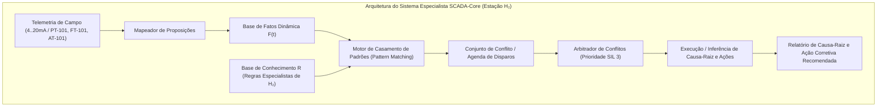

# Aula 08: Sistemas Especialistas — Base de Conhecimento e Regras de Diagnóstico

## 1. Fundamentos Matemáticos: Arquitetura de Sistemas Baseados em Regras (RBS).

Na **Estação de Reabastecimento de Hidrogênio** (SCADA-Core), a ocorrência de anomalias operacionais, desvios de processo ou falhas de instrumentos em campo exige diagnósticos automáticos de causa-raiz em tempo real, altamente determinísticos e de baixíssima latência, fundamentados em **Sistemas Especialistas Baseados em Regras** (Rule-Based Expert Systems). Essa abordagem computacional avançada permite estruturar o conhecimento heurístico de operadores experientes e especialistas em segurança de processos em uma base formal de produção, viabilizando a tomada de decisões autônomas e mitigando riscos operacionais críticos em tempo hábil.

Formalmente, um Sistema Baseado em Regras é modelado pela tripla:

$$\langle \mathcal{F}, \mathcal{R}, \mathcal{E} \rangle$$

Onde:
1. **$\mathcal{F}$ (Base de Fatos):** Conjunto finito de proposições que representam o estado instantâneo da planta de hidrogênio (ex.: alarmes ativos, leituras de sensores fora do limite):
   $$\mathcal{F}(t) = \{f_1, f_2, \dots, f_m\} \subseteq \mathcal{U}_{\text{fatos}}$$
2. **$\mathcal{R}$ (Base de Conhecimento / Regras de Produção):** Conjunto de sentenças em **Cláusulas de Horn Definidas** da forma:
   $$R_i: \quad \text{SE } (A_{i,1} \land A_{i,2} \land \dots \land A_{i,k}) \quad \text{ENTÃO } \quad C_i$$
   Equivalentemente em lógica formal:
   $$\neg A_{i,1} \lor \neg A_{i,2} \lor \dots \lor \neg A_{i,k} \lor C_i$$
3. **$\mathcal{E}$ (Estratégia de Resolução de Conflitos):** Critérios de arbitragem para seleção de regras ativadas simultaneamente (Prioridade de Segurança SIL / IEC 61508, Especificidade e Severidade da Falha).

---

## 2. Catálogo Especialista de Falhas da Estação de Reabastecimento de Hidrogênio.

A base de conhecimento cobre os cenários operacionais e de falha mais críticos do sistema SCADA-Core:

| ID Regra | Antecedentes ($\bigwedge A_i$) | Consequente ($C_i$) | Diagnóstico de Causa-Raiz | Severidade / Ação Corretiva Recomendada |
| :--- | :--- | :--- | :--- | :--- |
| **R-01** | `FT101_CORRENTE_BAIXA` | `FALHA_ELETRICA_FT101` | **Cabo Rompido / Falha Elétrica de Sensor** | **ALTA:** Manutenção corretiva na malha 4-20mA do FT-101 |
| **R-02** | `FT101_FLUXO_BAIXO` $\land$ `PT101_PRESSAO_BAIXA` | `CAVITACAO_BOMBA` | **Cavitação ou Falha na Bomba de Alimentação** | **CRÍTICA:** Desligar bomba e verificar sucção/válvula de montante |
| **R-03** | `PT101_PRESSAO_ALTA` $\land$ `LT101_NIVEL_ALTO` | `BLOQUEIO_SAIDA` | **Bloqueio na Linha de Saída / Sobretensão** | **CRÍTICA:** Abrir válvula de alívio e fechar alimentação XV-101 |
| **R-04** | `AT101_PH_BAIXO` | `DESVIO_DOSAGEM` | **Desvio de Dosagem Química (Acidificação)** | **MÉDIA:** Incrementar vazão da válvula de dosagem de base FCV-102 |
| **R-05** | `AT101_GAS_HIGH` $\land$ `XV301_ABERTA` | `VAZAMENTO_H2_DISP` | **Vazamento de H₂ na Zona do Dispensador** | **CRÍTICA (SIL 3):** Fechar válvula XV-301 e disparar Trip ESD-100 |
| **R-06** | `PT101_HIGH` $\land$ `TT101_HIGH` | `SOBREPRESSAO_BANCO_H2` | **Pressão e Temperatura Excessivas no Armazenamento** | **EMERGÊNCIA:** Despressurizar banco para alívio/venting e purga |

---

## 3. Resolução de Conflitos e Inconsistências na Base.

Uma Base de Conhecimento industrial para a Estação de Hidrogênio deve ser estritamente livre de **contradições** e **redundâncias**:
1. **Consistência Semântica:** Não podem coexistir regras onde os mesmos antecedentes gerem conclusões mutuamente exclusivas ($A \rightarrow C$ e $A \rightarrow \neg C$).
2. **Priorização por Severidade:** Regras associadas a vazamentos de $\text{H}_2$ ou risco de sobrepressão em vasos de 350/700 bar possuem prioridade máxima de execução ($\text{SIL 3} / \text{Prio} = 10$).

