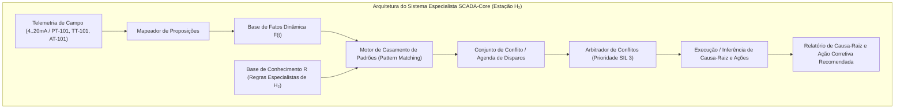

# Aula 08: Sistemas Especialistas — Base de Conhecimento e Regras de Diagnóstico

## 1. Fundamentos Matemáticos: Arquitetura de Sistemas Baseados em Regras (RBS).

Na **Estação de Reabastecimento de Hidrogênio** (SCADA-Core), a ocorrência de anomalias operacionais, desvios de processo ou falhas de instrumentos em campo exige diagnósticos automáticos de causa-raiz em tempo real, altamente determinísticos e de baixíssima latência, fundamentados em **Sistemas Especialistas Baseados em Regras** (Rule-Based Expert Systems). Essa abordagem computacional avançada permite estruturar o conhecimento heurístico de operadores experientes e especialistas em segurança de processos em uma base formal de produção, viabilizando a tomada de decisões autônomas e mitigando riscos operacionais críticos em tempo hábil.

Formalmente, um Sistema Baseado em Regras é modelado pela tripla:

$$\langle \mathcal{F}, \mathcal{R}, \mathcal{E} \rangle$$

Onde:
1. **$\mathcal{F}$ (Base de Fatos):** Conjunto finito de proposições que representam o estado instantâneo da planta de hidrogênio (ex.: alarmes ativos, leituras de sensores fora do limite):
   $$\mathcal{F}(t) = \{f_1, f_2, \dots, f_m\} \subseteq \mathcal{U}_{\text{fatos}}$$
2. **$\mathcal{R}$ (Base de Conhecimento / Regras de Produção):** Conjunto de sentenças em **Cláusulas de Horn Definidas** da forma:
   $$R_i: \quad \text{SE } (A_{i,1} \land A_{i,2} \land \dots \land A_{i,k}) \quad \text{ENTÃO } \quad C_i$$
   Equivalentemente em lógica formal:
   $$\neg A_{i,1} \lor \neg A_{i,2} \lor \dots \lor \neg A_{i,k} \lor C_i$$
3. **$\mathcal{E}$ (Estratégia de Resolução de Conflitos):** Critérios de arbitragem para seleção de regras ativadas simultaneamente (Prioridade de Segurança SIL / IEC 61508, Especificidade e Severidade da Falha).

```mermaid
graph TD
    subgraph "Arquitetura do Sistema Especialista SCADA-Core (Estação H₂)"
        TLM["Telemetria de Campo (4..20mA / PT-101, TT-101, AT-101)"] --> MAP["Mapeador de Proposições"]
        MAP --> FATOS["Base de Fatos Dinâmica F(t)"]
        FATOS --> MATCHER["Motor de Casamento de Padrões (Pattern Matching)"]
        REGRAS["Base de Conhecimento R (Regras Especialistas de H₂)"] --> MATCHER
        MATCHER --> AGENDA["Conjunto de Conflito / Agenda de Disparos"]
        ARBITR["Arbitrador de Conflitos (Prioridade SIL 3)"] --> EXEC["Execução / Inferência de Causa-Raiz e Ações"]
        AGENDA --> ARBITR
        EXEC --> DIAG["Relatório de Causa-Raiz e Ação Corretiva Recomendada"]
    end
```

---

## 2. Catálogo Especialista de Falhas da Estação de Reabastecimento de Hidrogênio.

A base de conhecimento cobre os cenários operacionais e de falha mais críticos do sistema SCADA-Core:

| ID Regra | Antecedentes ($\bigwedge A_i$) | Consequente ($C_i$) | Diagnóstico de Causa-Raiz | Severidade / Ação Corretiva Recomendada |
| :--- | :--- | :--- | :--- | :--- |
| **R-01** | `FT101_CORRENTE_BAIXA` | `FALHA_ELETRICA_FT101` | **Cabo Rompido / Falha Elétrica de Sensor** | **ALTA:** Manutenção corretiva na malha 4-20mA do FT-101 |
| **R-02** | `FT101_FLUXO_BAIXO` $\land$ `PT101_PRESSAO_BAIXA` | `CAVITACAO_BOMBA` | **Cavitação ou Falha na Bomba de Alimentação** | **CRÍTICA:** Desligar bomba e verificar sucção/válvula de montante |
| **R-03** | `PT101_PRESSAO_ALTA` $\land$ `LT101_NIVEL_ALTO` | `BLOQUEIO_SAIDA` | **Bloqueio na Linha de Saída / Sobretensão** | **CRÍTICA:** Abrir válvula de alívio e fechar alimentação XV-101 |
| **R-04** | `AT101_PH_BAIXO` | `DESVIO_DOSAGEM` | **Desvio de Dosagem Química (Acidificação)** | **MÉDIA:** Incrementar vazão da válvula de dosagem de base FCV-102 |
| **R-05** | `AT101_GAS_HIGH` $\land$ `XV301_ABERTA` | `VAZAMENTO_H2_DISP` | **Vazamento de H₂ na Zona do Dispensador** | **CRÍTICA (SIL 3):** Fechar válvula XV-301 e disparar Trip ESD-100 |
| **R-06** | `PT101_HIGH` $\land$ `TT101_HIGH` | `SOBREPRESSAO_BANCO_H2` | **Pressão e Temperatura Excessivas no Armazenamento** | **EMERGÊNCIA:** Despressurizar banco para alívio/venting e purga |

---

## 3. Resolução de Conflitos e Inconsistências na Base.

Uma Base de Conhecimento industrial para a Estação de Hidrogênio deve ser estritamente livre de **contradições** e **redundâncias**:
1. **Consistência Semântica:** Não podem coexistir regras onde os mesmos antecedentes gerem conclusões mutuamente exclusivas ($A \rightarrow C$ e $A \rightarrow \neg C$).
2. **Priorização por Severidade:** Regras associadas a vazamentos de $\text{H}_2$ ou risco de sobrepressão em vasos de 350/700 bar possuem prioridade máxima de execução ($\text{SIL 3} / \text{Prio} = 10$).

---

## 4. Verificação Formal de Consistência e Não-Circularidade das Regras

Para garantir que o motor de inferência opere em tempo real com determinismo temporal e segurança intrínseca, a base de conhecimento de regras de produção $\mathcal{R}$ deve satisfazer formalmente dois critérios fundamentais:

### 4.1 Critério de Consistência Semântica (Ausência de Contradições)
Uma base de regras é dita consistente se, a partir de qualquer conjunto válido de fatos de campo $\mathcal{F} \subseteq \mathcal{U}_{\text{fatos}}$, não é possível inferir simultaneamente uma conclusão e a sua negação lógica:

$$\forall \mathcal{F}_{\text{válido}}, \quad \mathcal{R}(\mathcal{F}) \not\vdash (C \land \neg C)$$

Formalmente, para quaisquer regras $R_j, R_k \in \mathcal{R}$:
$$\text{Se } \bigwedge A_j \subseteq \mathcal{F} \implies C_j \quad \text{e} \quad \bigwedge A_k \subseteq \mathcal{F} \implies C_k$$
não pode ocorrer a condição contraditória $C_j \iff \neg C_k$. Em caso de ativação de regras com premissas concorrentes (ex.: comando manual de liberação versus alarme de vazamento de $\text{H}_2$), aplica-se a estratégia de resolução de conflitos $\mathcal{E}$, garantindo que o consequente de maior severidade de segurança (SIL 3) iniba o permissivo antagônico, mantendo a consistência do sistema.

### 4.2 Critério de Acyclicidade e Não-Circularidade (Garantia de Terminação)
A base de regras $\mathcal{R}$ define naturalmente um Grafo Direcionado de Dependências $\mathcal{G} = (\mathcal{V}, \mathcal{E})$, onde:
- Os vértices $\mathcal{V}$ são as proposições e diagnósticos da planta ($\mathcal{V} = \mathcal{U}_{\text{fatos}}$).
- Existe uma aresta direcionada $(u, v) \in \mathcal{E}$ se a proposição $u$ figura como antecedente de uma regra $R_i$ cujo consequente é $v$ ($u \in \text{Antecedentes}(R_i) \land v = \text{Consequente}(R_i)$).

Para que o motor de inferência *Forward Chaining* convirja ao ponto fixo em tempo finito e sem laços infinitos, o grafo $\mathcal{G}$ deve ser estritamente um **Grafo Acíclico Direcionado (DAG)**:

$$\nexists (v_1, v_2, \dots, v_m, v_1) \subseteq \mathcal{E}$$

A ausência de circularidade assegura que:
1. O algoritmo atinge a saturação de novos fatos em no máximo $|\mathcal{R}|$ iterações.
2. A complexidade de tempo de execução no ciclo de varredura (*scan cycle*) é estritamente $\mathcal{O}(|\mathcal{R}| \cdot |\mathcal{F}|)$, garantindo previsibilidade de tempo real determinístico.
