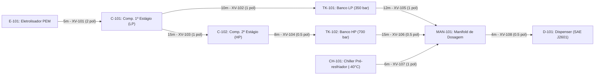

# Aula 11: Teoria dos Grafos — Modelagem de Tubulações e Instrumentos

## 1. Fundamentos Matemáticos: Definição Formal de Dígrafos Ponderados

Um **Grafo Dirigido e Ponderado (Dígrafo)** que modela a infraestrutura hidráulica da Estação de Reabastecimento de Hidrogênio é formalmente definido pela tripla:
$$G = (V, E, W)$$

Onde:
1. **$V = \{v_1, v_2, \dots, v_n\}$** é o conjunto finito de **vértices (nós)**: eletrolisador PEM, compressores de múltiplos estágios, tanques de armazenamento em cascata, trocador de calor criogênico (chiller), manifold de distribuição e dispenser veicular.
2. **$E \subseteq V \times V$** é o conjunto de **arestas dirigidas (arcos)** de tubulação de alta pressão com sentido de fluxo permitido e regulado por válvulas de corte rápido (on/off) com atuadores pneumáticos/solenoides.
3. **$W: E \rightarrow \mathbb{R}^+$** é a **função de ponderação**, que associa a cada duto um custo operacional ou restrição física (comprimento físico da linha $L\text{ [m]}$, perda de carga $\Delta P\text{ [bar]}$, ou diâmetro interno nominal).

A leitura do diagrama topológico acima reflete fielmente o fluxograma de engenharia (P&ID) da estação:
* Cada seta dirigida representa uma linha física de condução de gás hidrogênio ($H_2$) sob regime forçado de pressão.
* Os rótulos detalham o comprimento físico em metros ($L$), a identificação da válvula de bloqueio rápido instrumentada pela norma ISA-5.1 (`XV-101` a `XV-108`) e a bitola nominal da tubulação em polegadas.

---

## 2. Por que um Grafo e não uma Lista de Equipamentos?

Tradicionalmente, plantas industriais e estações de compressão são catalogadas em planilhas ou bancos de dados relacionais na forma de listas tabulares de equipamentos (*equipment lists*) e listas de linhas (*line lists*). Embora úteis para compras e montagem de tubulações, tabelas relacionais isoladas ocultam propriedades fundamentais da dinâmica de escoamento e da automação:

1. **Conectividade e Rastreabilidade:** Permite verificar deterministicamente se existe rota contínua entre a unidade geradora (`E-101`) e o receptáculo do veículo (`D-101`) com todas as válvulas intermediárias abertas.
2. **Redundância e Confiabilidade:** O grau de entrada do manifold ($\deg^-(MAN\text{-}101) = 3$) evidencia a existência de alimentação em cascata (tanque de baixa pressão `TK-101`, tanque de alta pressão `TK-102` e linha de condicionamento térmico `CH-101`), permitindo abastecimento escalonado conforme o protocolo SAE J2601.
3. **Composição Algorítmica no SCADA:** Ao mapear a planta como grafo, algoritmos clássicos de otimização (Dijkstra para seleção da linha de menor perda de carga, BFS para varredura de isolamento de trechos e DFS para busca de rotas de alívio de pressão) operam em tempo real no supervisório SCADA.

### 2.1. Definições Fundamentais de Teoria dos Grafos

* **Ordem do Grafo ($|V| = n$):** Número de nós estruturais ($n = 8$ equipamentos de processo).
* **Tamanho do Grafo ($|E| = m$):** Número de arcos de tubulação ($m = 8$ dutos ativos).
* **Passeio (*walk*):** Sequência alternada $v_0, e_1, v_1, \dots, e_k, v_k$ onde cada $e_i = (v_{i-1}, v_i) \in E$. Modela a trajetória de uma massa de moléculas de $H_2$ ao longo do tempo.
* **Caminho (*path*):** Passeio sem vértices repetidos. Representa uma rota de transferência direta de hidrogênio (ex.: `E-101` $\rightarrow$ `C-101` $\rightarrow$ `TK-101` $\rightarrow$ `MAN-101` $\rightarrow$ `D-101`).
* **Trilha (*trail*):** Passeio sem repetição de arestas (dutos), embora equipamentos possam ser revisitados. Essencial para rotinas de inspeção de tubulações e detecção acústica de vazamentos.
* **Ciclo (*cycle*):** Caminho fechado ($v_0 = v_k$) com $k \geq 1$ arestas. A presença de ciclos na topologia não-dirigida subjacente viabiliza **rotas alternativas de contingência e recirculação**.
* **Grau de Saída ($\deg^+(v)$):** Número de tubulações que partem do equipamento $v$.
* **Grau de Entrada ($\deg^-(v)$):** Número de tubulações que chegam ao equipamento $v$.

### 2.2. Lema do Aperto de Mãos Dirigido

Para qualquer dígrafo $G = (V, E)$, a soma dos graus de saída iguala a soma dos graus de entrada, sendo idêntica ao número total de arestas:

$$\sum_{v \in V} \deg^+(v) = \sum_{v \in V} \deg^-(v) = |E|$$

**Justificativa Física:** Cada duto instalado conecta exatamente um equipamento de montante a um equipamento de jusante. Logo, ao adicionar uma tubulação $e = (u, v)$, incrementa-se em exatamente $+1$ o grau de saída de $u$ e em $+1$ o grau de entrada de $v$.

**Verificação Topológica na Estação de Hidrogênio:**
* Soma dos graus de saída:
  $$\sum_{v \in V} \deg^+(v) = 1 (\text{E-101}) + 2 (\text{C-101}) + 1 (\text{C-102}) + 1 (\text{TK-101}) + 1 (\text{TK-102}) + 1 (\text{CH-101}) + 1 (\text{MAN-101}) + 0 (\text{D-101}) = 8$$
* Soma dos graus de entrada:
  $$\sum_{v \in V} \deg^-(v) = 0 (\text{E-101}) + 1 (\text{C-101}) + 1 (\text{C-102}) + 1 (\text{TK-101}) + 1 (\text{TK-102}) + 0 (\text{CH-101}) + 3 (\text{MAN-101}) + 1 (\text{D-101}) = 8$$
* Ambos os somatórios resultam em $8 = |E|$, confirmando a consistência topológica da planta.

### 2.3. Representações Computacionais e Trade-offs

| Representação | Estrutura em Memória | Custo de Espaço | Busca de Aresta $(u,v)$ | Recomendação de Uso no SCADA |
| :--- | :--- | :--- | :--- | :--- |
| **Matriz de Adjacência** | `float[n][n]` | $O(n^2)$ | $O(1)$ | Grafos densos, álgebra linear, matrizes de distâncias e caminho mínimo (Dijkstra) |
| **Lista de Adjacência** | `dict[str, list]` | $O(n + m)$ | $O(\deg(u))$ | Grafos industriais esparsos ($m \approx n$), algoritmos de busca topológica (BFS/DFS) |
| **Matriz de Incidência** | `int[n][m]` | $O(n \cdot m)$ | — | Balanço matricial de massa ($B \cdot \vec{Q} = \vec{S}$), leis de conservação (Aula 12) |

A classe `GrafoTubulacao` implementa uma matriz de adjacência dupla:
1. `adj_binaria`: Matriz booleana $\{0, 1\}$ para verificação instantânea de conectividade física.
2. `adj_pesos`: Matriz de distâncias/custos ponderados em metros, onde posições sem ligação direta recebem $\infty$ e a diagonal principal é inicializada em $0.0$.

### 2.4. Grafo Simples vs. Multigrafo em Plantas de Alta Pressão

No projeto industrial de estações de hidrogênio, certos subsistemas críticos utilizam **linhas gêmeas de tubulação** para manutenção em operação (*by-pass* com redundância 100%). Se dois equipamentos forem interligados por duas tubulações físicas paralelas com válvulas independentes (ex.: duas linhas de alta pressão entre `TK-102` e `MAN-101`), o grafo passa a ser formalmente um **Multigrafo**. A representação matricial padrão $A[u][v]$ deve então ser expandida para armazenar listas de arestas ou utilizar a Matriz de Incidência $B$, que suporta nativamente múltiplas arestas entre os mesmos pares de nós.

---

## 3. Exemplo Resolvido

**Problema:** Analise os graus topológicos do nó `C-101` (Compressor de 1º Estágio) e do nó `MAN-101` (Manifold de Dosagem). Explique o significado físico e operacional de cada um desses valores na lógica de controle do SCADA Core.

**Resolução:**

1. **Compressor `C-101`:**
   * $\deg^-(C\text{-}101) = 1$: Recebe hidrogênio de baixa pressão exclusivamente do Eletrolisador `E-101` via tubulação $e_1$.
   * $\deg^+(C\text{-}101) = 2$: Possui duas descargas possíveis: tubulação $e_2$ (alimentando o tanque LP `TK-101`) e tubulação $e_3$ (alimentando a sucção do 2º estágio `C-102`).
   * *Significado SCADA:* O compressor atua como um divisor de fluxo e nó de bifurcação de pressão. O intertravamento lógico deve assegurar que ao menos uma das válvulas de descarga (`XV-102` ou `XV-103`) esteja 100% aberta antes da partida do motor do compressor para evitar sobrepressão catastrófica.

2. **Manifold `MAN-101`:**
   * $\deg^-(MAN\text{-}101) = 3$: Recebe linhas dos três bancos/fontes (`TK-101`, `TK-102` e `CH-101`).
   * $\deg^+(MAN\text{-}101) = 1$: Descarrega através da tubulação $e_8$ para o dispenser veicular `D-101`.
   * *Significado SCADA:* O manifold é o elemento de convergência e dosagem da estação. Ele permite ao algoritmo de controle chavear entre os estágios de pressão de abastecimento (protocolo de rampa de pressão de 350 bar para 700 bar), garantindo o resfriamento simultâneo do hidrogênio a $-40^\circ\text{C}$.

---

## 4. Atividades de Investigação

1. **Consistência do Lema do Aperto de Mãos:**
   Demonstre analiticamente por que é matematicamente impossível existir um dígrafo representativo de uma planta com exatamente um equipamento possuindo grau de saída ímpar e todos os demais com grau de saída par, se a soma de todos os graus de entrada da planta for comprovadamente par.

2. **Modelagem de Redundância e Multigrafo:**
   Se a engenharia de segurança adicionar uma segunda linha de tubulação paralela de alta pressão entre o tanque `TK-102` e o manifold `MAN-101` (equipada com a válvula `XV-106B`), mostre como a matriz de adjacência `adj_pesos` é afetada e explique por que a Matriz de Incidência $B$ acomoda essa alteração sem ambiguidade.

3. **Classificação de Rotas Operacionais:**
   Considere o percurso completo de abastecimento veicular:
   $$\text{Rota: } E\text{-}101 \rightarrow C\text{-}101 \rightarrow C\text{-}102 \rightarrow TK\text{-}102 \rightarrow MAN\text{-}101 \rightarrow D\text{-}101$$
   Classifique formalmente essa sequência como passeio, caminho ou trilha. Justifique com base nas definições formais de teoria dos grafos.

4. **Identificação de Ciclos e Linha de Recirculação:**
   Suponha a inclusão de uma linha de purga e retorno de $H_2$ não consumido conectando o dispenser `D-101` de volta à entrada do compressor de 1º estágio `C-101` (para testes de estanqueidade e condicionamento de bico). Quantos ciclos simples passam a existir no grafo dirigido resultante? Liste os vértices de cada ciclo.

---

## 5. Entregável da Aula 11

* **Classe `GrafoTubulacao` em Python:** Estrutura orientada a objetos com suporte a nós ISA-5.1, inserção de tubulações com peso e válvula associada, e exportação das matrizes de adjacência para o sistema SCADA da Estação de Reabastecimento de Hidrogênio.
