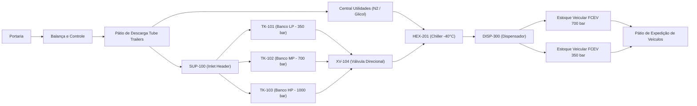
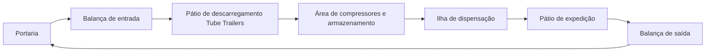

# Aula 18: Grafos de Logística de Insumos, Processo e Produtos Acabados

## 1. Situação-Problema

Nas aulas anteriores, a **Estação de Reabastecimento de Hidrogênio — SCADA Core** foi representada fundamentalmente pela malha física interna de processo: manifold de suprimento (`SUP-100`), bancos de armazenamento em cascata (`TK-101`, `TK-102`, `TK-103`), válvula direcional (`XV-104`), trocador criogênico chiller (`HEX-201`), dispensador (`DISP-300`) e veículo FCEV (`VEIC-300`).

Entretanto, a operação industrial completa de um posto de hidrogênio exige também integrar a **cadeia logística externa e de pátio**: decidir como o hidrogênio comprimido a granel (*tube trailers* a 200–300 bar) e as utilidades operacionais (nitrogênio de purga e fluido refrigerante) chegam à estação, como circulam com segurança entre as áreas classificadas (zonas ATEX) e como os veículos leves e pesados abastecidos são despachados.

O objetivo desta aula é construir modelos de grafos que conectem a logística de pátio ao processo de hidrogênio descrito na [Etapa 01](../etapa-01-logica/00%20-%20Insumos.md), sem confundir fluxos física e operacionalmente distintos.

> **Nota metodológica:** os comprimentos empregados nesta aula são estimativas didáticas para comparação de rotas no layout da planta esquemática da estação.

---

## 2. Fundamentos Teóricos: Redes Multicamada e Grafos Acíclicos Dirigidos

### 2.1. Por que o Fluxo de Materiais é um DAG

Diferente da malha interna de tubulação das Aulas 11 a 15 (que continha rotas paralelas de contingência entre os três bancos de armazenamento), o fluxo completo de materiais $G_M$ — do recebimento na portaria até a expedição dos veículos abastecidos — é, por definição termodinâmica e operacional, um **Grafo Acíclico Dirigido (DAG — *Directed Acyclic Graph*)**:

Não existe caminho que retorne a um vértice já visitado, pois cada etapa (recebimento a granel, compressão por patamar de pressão, resfriamento a $-40^\circ\text{C}$ e injeção no tanque veicular Tipo IV a 700 bar) é termodinamicamente irreversível no fluxo normal de abastecimento.

**Definição formal:** um dígrafo $G=(V,E)$ é um DAG se não existe nenhum ciclo dirigido, ou seja, não existe sequência $v_0, v_1, \dots, v_k = v_0$ com $(v_{i-1}, v_i) \in E$ para todo $i$.

**Propriedade fundamental (ordenação topológica):** todo DAG admite pelo menos uma **ordenação topológica**, isto é, uma numeração dos vértices $\text{ord}: V \rightarrow \{1, \dots, n\}$ tal que, para toda aresta $(u,v) \in E$, $\text{ord}(u) < \text{ord}(v)$. Essa propriedade permite auditar a operação: qualquer rotina de automação pode ser validada checando se respeita a ordem lógica do DAG — por exemplo, o SCADA proíbe que o comando de abertura do bico (`XV-301`) ocorra antes da confirmação de acoplamento do *breakaway* (`BV-301`) e do resfriamento criogênico (`HEX-201`), pois não existe ordenação topológica compatível com essa inversão.

**Algoritmo de Kahn (1962):** calcula a ordenação topológica em $O(|V|+|E|)$ removendo iterativamente os nós com grau de entrada zero e decrementando o grau de seus sucessores. Se ao final restarem vértices, o grafo contém ciclos e não é um DAG.

### 2.2. Redes Multicamada (*Multilayer Networks*)

A estratégia de modelar **três grafos distintos** ($G_M$, $G_V$, $G_E$) sobre a mesma estação física é um caso particular de **redes multicamada**: uma tupla $\mathcal{M} = (\{G_\alpha\}_{\alpha \in L}, \{V_\alpha\}, \{E_{\alpha\beta}\})$ onde $L$ representa as camadas (`materiais`, `veículos`, `estoque`).

Separar essas camadas impede erros graves de projeto, como aplicar Dijkstra sobre o grafo de processo para decidir por onde uma carreta de 40 toneladas deve transitar no pátio viário. O vértice `Dispensador` em $G_M$ representa a válvula e o medidor mássico Coriolis, enquanto em $G_V$ representa a vaga física da ilha de abastecimento.

### 2.3. Cadeia de Suprimentos como Composição de Grafos

| Subproblema da planta de H₂ | Ferramenta da Etapa 02 aplicável |
| --- | --- |
| Menor rota da carreta de recebimento até a expedição | Dijkstra (Aulas 14 e 18) |
| Desvio automático em caso de vazamento de H₂ | Reponderação dinâmica com $W \leftarrow \infty$ (Aula 15) |
| Inspeção total de dutos contra fragilização mecânica | Circuito Euleriano via Hierholzer (Aula 16) |
| Ronda de amostragem de pureza (SAE J2719) por AGV | Ciclo Hamiltoniano / TSP via NN + 2-Opt (Aula 17) |
| Validação de sequência física de abastecimento | Ordenação topológica de DAG (Aula 18) |

---

## 3. Três Grafos para o mesmo Layout da Estação

| Grafo | Vértices | Arestas dirigidas | Peso | Pergunta respondida |
| --- | --- | --- | --- | --- |
| $G_M$ — fluxo de materiais | portaria, descarregamento, tanques, chiller e dispensadores | transferência permitida de massa de H₂ e utilidades | distância física estimada (m) | Como o H₂ chega da carreta ao tanque do veículo FCEV? |
| $G_V$ — circulação de veículos | portaria, balanças, pátios de manobra e ilhas de abastecimento | vias autorizadas para tráfego interno de veículos | extensão viária de pista (m) | Qual rota interna segura a carreta e o carro FCEV percorrem? |
| $G_E$ — alocação de estoque | patamares LP (350 bar), MP (700 bar) e HP (1000 bar) | comutação de bancos pelo manifold | capacidade volumétrica ou perda de carga | Em qual banco armazenar e de onde transferir em cada etapa da cascata? |

---

## 4. Grafo Dirigido do Fluxo de Materiais ($G_M$)

Definimos $G_M = (V_M, E_M, w_M)$, com pesos não-negativos $w_M: E_M \rightarrow \mathbb{R}_{\ge 0}$ representando comprimentos físicos das linhas:

### 4.1. Correspondência com os Insumos da Etapa 01

| Insumo da Etapa 01 | Vértice de entrada | Papel no modelo logístico |
| --- | --- | --- |
| Gás Hidrogênio ($H_2$) a granel | `Pátio de Descarga Tube Trailers` | Matéria-prima principal recebida em carretas de tubos |
| Injeção no Manifold Principal | `SUP-100 (Inlet Header)` | Distribuição para os bancos de armazenamento |
| Armazenamento em Cascata LP/MP/HP | `TK-101`, `TK-102`, `TK-103` | Estocagem por nível de pressão com válvulas `XV-101/102/103` |
| Fluido Refrigerante / Glicol | `Central de Utilidades (N2 / Glicol)` | Resfriamento do hidrogênio até $-40^\circ\text{C}$ no `HEX-201` |
| Nitrogênio ($N_2$) de Purga | `Central de Utilidades (N2 / Glicol)` | Insumo de segurança para inertização prévia das tubulações |
| Produto Acabado — FCEV Leve | `Estoque Veicular FCEV 700 bar` | Abastecimento de automóveis a 700 bar (protocolo J2601) |
| Produto Acabado — FCEV Pesado | `Estoque Veicular FCEV 350 bar` | Abastecimento de ônibus e caminhões urbanos a 350 bar |

---

## 5. Grafo de Circulação de Veículos ($G_V$)

O fluxo de hidrogênio é acíclico, mas a malha viária do pátio é um **anel viário de sentido único** com ciclo fechado na Portaria, garantindo a segregação entre o tráfego pesado das carretas e a circulação dos veículos de passeio:

---

## 6. Exemplo Resolvido

**Pergunta:** Analise a rota de menor custo de `Portaria` até `Pátio de Expedição de Veículos` em $G_M$ obtida pelo notebook. Por que o algoritmo seleciona o banco `TK-101 (LP)` como rota preferencial?

**Resolução:** Na malha de processo, as distâncias acumuladas desde `SUP-100` até a válvula direcional `XV-104` através dos três bancos são:
- Via `TK-101 (LP)`: $10\,\text{m} + 8\,\text{m} = 18\,\text{m}$
- Via `TK-102 (MP)`: $12\,\text{m} + 6\,\text{m} = 18\,\text{m}$ (empate técnico com LP)
- Via `TK-103 (HP)`: $15\,\text{m} + 8\,\text{m} = 23\,\text{m}$

O Dijkstra desempata selecionando `TK-101`, totalizando $154\,\text{m}$ desde a portaria até a expedição veicular. Isso espelha a estratégia operacional real da estação: o abastecimento de um FCEV começa sempre pelo banco de menor pressão (LP) para equalização inicial por pressão diferencial sem sobrecarregar os compressores de alta pressão.

---

## 7. Atividades de Investigação

1. Execute o notebook e identifique a diferença de distância de abastecimento para o `Estoque Veicular FCEV 700 bar` versus `Estoque Veicular FCEV 350 bar`.
2. Simule uma manutenção no banco de baixa pressão removendo a aresta `SUP-100 -> TK-101`. Qual passa a ser a nova rota ótima e qual a distância total resultante?
3. No grafo $G_V$, suponha que a via entre `Área de compressores e armazenamento` e `Ilha de dispensação` seja interditada por obras. Como o modelo detecta a perda de conexidade?
4. Substitua os pesos de distância (metros) por tempo médio operacional (minutos), considerando que o descarregamento de uma carreta de tubos leva 90 minutos enquanto a dispensa veicular leva 3 a 5 minutos. Como essa mudança altera a noção de “gargalo logístico”?
5. Inclua um vértice `Quarentena e Análise de Pureza (ISO 14687)` entre a descarga da carreta e o `SUP-100`. Que condição do SCADA deve liberar a aresta para injeção nos tanques?

---

## 8. Entregável da Aula 18

* **Módulo `GrafoLogistico` em Python:** Criação de grafos dirigidos e ponderados, cálculo do menor caminho com Dijkstra e relatório analítico completo.
* **Dois modelos integrados para a Estação de Hidrogênio:** uma rede para o fluxo de materiais e utilidades ($G_M$) e outra para o anel viário de circulação veicular ($G_V$).
